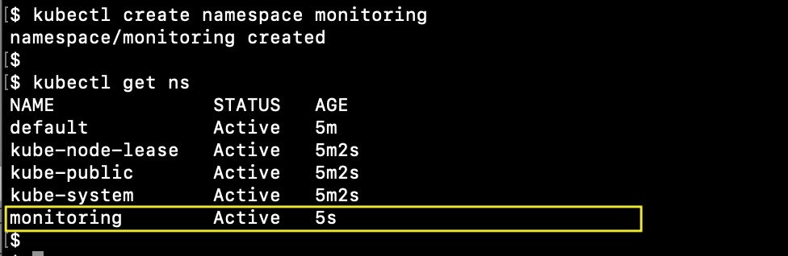
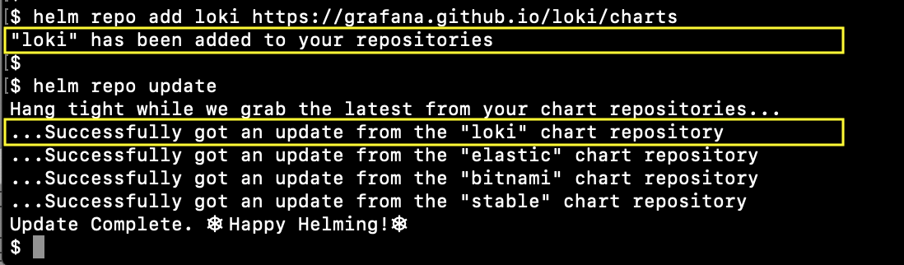
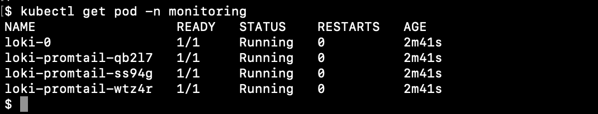
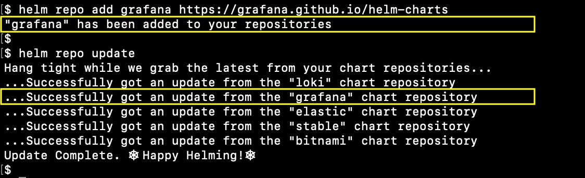
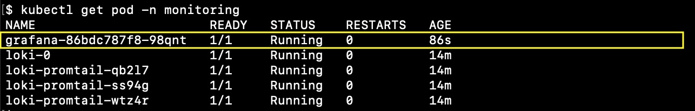
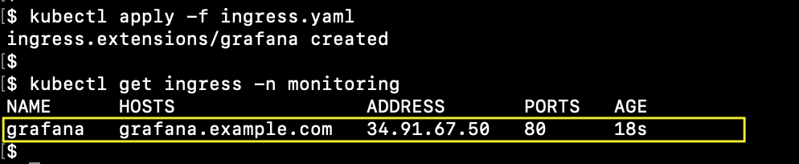
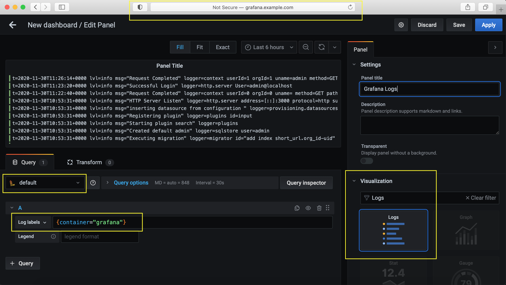

# Example of Loki Stack in K8S cluster


## Example

* the kubernetes cluster with configured persistent volumes and ingress-controller
* **kubectl** ([installation guide is here](https://kubernetes.io/docs/tasks/tools/install-kubectl/)), **helm** ([installation guide is here](https://helm.sh/docs/intro/install/))
* example domain **grafana.example.com**


## Namespace

Create the monitoring namespace
```
kubectl create namespace monitoring
```




## Loki stack

Add and update Loki helm chart repository
```
helm repo add loki https://grafana.github.io/loki/charts
helm repo update
```




Install Loki stack
```
helm install loki loki/loki-stack --namespace monitoring -f loki.values.yaml
```




## Grafana

Add and update Grafana helm chart repository
```
helm repo add grafana https://grafana.github.io/helm-charts
helm repo update
```




Install Grafana 
```
helm install grafana grafana/grafana --namespace monitoring -f grafana.values.yaml
```




Get admin password
```
kubectl get secret --namespace monitoring grafana -o jsonpath="{.data.admin-password}" | base64 --decode ; echo
```

Deploy Grafana ingress
```
kubectl apply -f ingress.yaml
```




Add ingress IP address to **/etc/hosts** for **grafana.example.com**

Check out web interface in browser. Sign in with user **admin** and password.

Create new dashboard and panel. Our Loki datasource is available and it is the default datasource.

Set log labels with value **container="grafana"** (it is an example, you can try any other meta label **app**, **namespace**, etc), set visualization type **Logs**.


